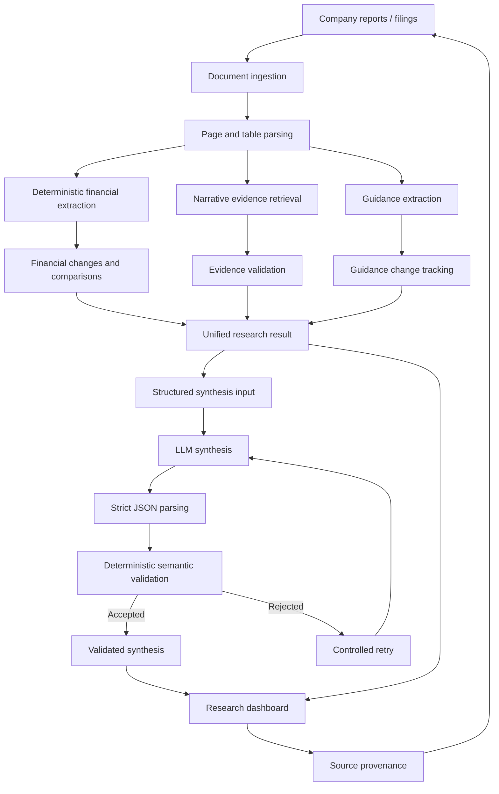

# EquityLens AI

**Evidence-grounded AI equity research with deterministic finance, auditable provenance and guarded LLM synthesis.**

EquityLens transforms company filings and quarterly reports into structured, traceable equity research.

Instead of sending an entire PDF to a language model and asking it to "analyze the company", EquityLens separates the research process into controlled layers:

- deterministic financial calculations
- source-level provenance
- evidence-gated management narrative
- forward guidance tracking
- guarded AI synthesis
- semantic validation before AI output is accepted

The result is an equity research workflow where important claims can be traced back to the underlying source material.

---

## Why EquityLens?

Financial analysis with LLMs has a fundamental problem:

> A fluent answer is not necessarily a correct or auditable answer.

Traditional "chat with PDF" systems can mix calculations, interpretation, historical performance and forward-looking statements inside a single generative step.

EquityLens takes a different approach.

The language model is **not the calculation engine**.

Financial facts are extracted and calculated deterministically. Narrative evidence must pass explicit validation rules. Guidance is modeled separately from historical results. The LLM receives structured research data rather than raw company reports, and its output must pass deterministic semantic validation before it can be displayed as accepted research.

---

## Dashboard

EquityLens includes a multi-company Streamlit research dashboard.

Current validated company cases:

- **Aker BP ASA — AKRBP**
- **Equinor ASA — EQNR**

The dashboard provides:

- executive research snapshot
- quarter-on-quarter financial analysis
- forward guidance tracker
- management evidence controls
- validated AI synthesis
- exact source provenance
- direct links back to company reports

The research engine is shared across companies rather than being implemented as separate hard-coded dashboards.

---

## Architecture



---

## Core design principle

### AI writes. EquityLens decides what is allowed through.

The LLM cannot independently decide what counts as valid financial evidence.

EquityLens controls the research boundary before and after generation.

For example:

- financial observations must reference the exact deterministic source facts used in the calculation
- management explanations are only allowed when validated direct narrative evidence exists
- consistency conclusions are only allowed when the evidence layer supports them
- guidance claims must correspond to known guidance items and their validated change type
- historical financial performance and forward-looking guidance are kept separate
- rejected model output is never shown as accepted research

---

## Example: guardrails in practice

During a live Equinor dashboard run, the first synthesis attempt incorrectly represented an unchanged guidance item as a guidance update.

EquityLens rejected the claim:

```text
Claim 'claim-6' does not match guidance change type 'unchanged'.
```

The model then received a controlled retry.

The second output passed the unchanged validation rules and was accepted.

This behavior is intentional: a plausible model response is not enough. It must remain inside the structured research evidence boundary.

---

## Deterministic financial analysis

Financial calculations are performed in Python rather than by the LLM.

The pipeline supports structured period comparisons including:

- source values
- absolute change
- percentage change
- comparison classification
- source document
- page
- table
- row
- column
- auditable fact IDs

### Example — Aker BP Q1 2026 → Q2 2026

| Metric | Q1 2026 | Q2 2026 | Change |
|---|---:|---:|---:|
| Net income | USD 758m | USD 521m | -31.3% |
| Basic EPS | USD 1.20 | USD 0.82 | -31.7% |
| Operating cash flow | USD 2,013m | USD 3,123m | +55.1% |
| Equity production | 398.4 mboe/day | 383.6 mboe/day | -3.7% |

The model does not calculate these values.

It receives the validated results after the deterministic finance layer has already produced them.

---

## Evidence-gated management narrative

A related sentence from a company report is not automatically treated as an explanation.

EquityLens distinguishes between evidence states such as:

- `direct_explanation`
- `aligned_context_only`
- `unavailable`
- `not_evaluated`

This allows the system to say:

> No validated direct explanation supports this period comparison.

rather than inventing a causal explanation merely because related text exists in the report.

Conservative unavailability is treated as a feature rather than a failure.

---

## Scope-aware evidence validation

Company reports frequently mix information across:

- group level
- business segments
- individual assets
- projects
- outlook sections

EquityLens applies scope-aware validation so that an asset-level explanation cannot automatically be used to explain a group-level financial metric.

This helps prevent semantically related but analytically invalid evidence from entering the research output.

---

## Guidance tracking

Forward guidance is modeled separately from historical performance.

The system tracks:

- changed guidance
- unchanged guidance
- newly introduced guidance
- withdrawn guidance
- point estimates
- approximate values
- numeric ranges
- target periods
- source page and section

### Example — Aker BP Q1 2026 → Q2 2026

The system detected changes including:

- production guidance: **370–400 → 380–400 mboepd**
- capex guidance: **USD 6.2–6.7bn → USD 6.8–7.2bn**

while keeping unchanged guidance items separate.

This prevents the model from treating an unchanged outlook statement as a new update.

---

## Guarded AI synthesis

The AI layer receives a structured `SynthesisInput` generated from the validated research result.

It does **not** receive the raw PDF as its reasoning environment.

The synthesis output supports four controlled claim types:

```text
financial_observation
management_explanation
consistency_observation
guidance_update
```

Every generated claim must satisfy deterministic eligibility and provenance rules.

The pipeline uses:

1. structured research input
2. strict JSON schema output
3. parser validation
4. semantic validation
5. controlled retry after rejection
6. accepted `ValidatedSynthesis` only

Raw model output is never treated as accepted research.

---

## Source provenance

Every financial observation can be traced back to its source facts.

The dashboard exposes information such as:

```text
Period
Value
Unit
Document
Page
Table
Row
Column
Fact ID
```

Where a public source URL is available, the dashboard also provides an **Open report** action to return directly to the company source document.

The objective is:

> claim → fact → document → page → source

rather than simply displaying a generated answer.

---

## Multi-company design

EquityLens was first developed vertically and then tested across a second company to reduce company-specific overfitting.

The current research cases cover:

### Aker BP

Validated examples include:

- net income
- earnings per share
- operating cash flow
- equity production
- production guidance
- capex guidance
- production cost guidance
- exploration spending
- abandonment spending
- dividend guidance

### Equinor

Validated examples include:

- net operating income
- net income
- adjusted operating income
- adjusted net income
- company guidance
- share buyback changes
- management narrative retrieval
- scope-aware evidence validation

The two companies use the same core research architecture.

---

## Research pipeline

At a high level:

```text
Source documents
      ↓
Document metadata + integrity checks
      ↓
PDF / table parsing
      ↓
Deterministic financial extraction
      ↓
Period comparison
      ↓
Narrative retrieval
      ↓
Evidence + scope validation
      ↓
Guidance tracking
      ↓
Narrative consistency assessment
      ↓
Unified research result
      ↓
Structured synthesis input
      ↓
Guarded LLM synthesis
      ↓
Semantic validation
      ↓
Research dashboard + provenance
```

---

## Project structure

```text
equitylens-ai/
│
├── .github/
│   └── workflows/           # CI
│
├── .streamlit/              # Streamlit configuration
│
├── data/
│   └── raw/                 # Research source documents
│
├── scripts/                 # Integration and live validation scripts
│
├── src/
│   └── equitylens/          # Core research engine
│
├── tests/                   # Unit, integration and adversarial tests
│
├── app.py                   # Multi-company research dashboard
├── pyproject.toml           # Project dependencies and tooling
├── .env.example             # Environment variable template
└── README.md
```

---

## Technology

Core stack:

- **Python 3.12**
- **Streamlit**
- **PyMuPDF**
- **PyMuPDF4LLM**
- **Docling**
- **OpenAI Responses API**
- **pytest**
- **Ruff**
- **GitHub Actions**

The current guarded synthesis client uses `gpt-5.6-luna` with low reasoning effort.

---

## Testing and quality controls

The project currently contains **504 passing tests** across the local test suite.

Testing includes:

- financial extraction
- table parsing
- document parsing
- reporting periods
- multi-period analysis
- audit trail construction
- narrative retrieval
- evidence assessment
- scope validation
- guidance tracking
- narrative consistency
- synthesis parsing
- synthesis semantic validation
- controlled retry behavior
- adversarial synthesis cases
- multi-company integration
- real-document integration tests

CI runs both:

- lint and unit tests
- integration tests against verified source documents

Live paid API calls are deliberately excluded from normal CI.

---

## Run locally

### 1. Clone the repository

```bash
git clone https://github.com/AndreasOftedal/equitylens-ai.git
cd equitylens-ai
```

### 2. Create a Python environment

```bash
python -m venv .venv
```

PowerShell:

```powershell
.\.venv\Scripts\Activate.ps1
```

### 3. Install the project

```bash
pip install -e ".[dev]"
```

### 4. Configure the OpenAI API key

Copy the example environment file:

```powershell
Copy-Item .env.example .env
```

Add your key to `.env`:

```text
OPENAI_API_KEY=your_key_here
```

The API key is only required for live AI synthesis.

The deterministic financial research pipeline can operate independently of live synthesis.

### 5. Start the dashboard

```bash
streamlit run app.py
```

Then open:

```text
http://localhost:8501
```

---

## Run the tests

```bash
pytest -q
```

Lint:

```bash
ruff check src tests app.py
```

---

## What EquityLens is not

EquityLens is intentionally **not**:

- a generic chatbot
- a raw PDF-to-LLM wrapper
- an autonomous investment recommendation engine
- a system where the LLM performs financial calculations
- a replacement for professional investment research

The project focuses on the engineering problem of making AI-assisted financial research more structured, auditable and evidence-grounded.

---

## Current limitations

The current version is a portfolio research system rather than a production investment platform.

Current limitations include:

- validated company coverage is currently focused on Aker BP and Equinor
- narrative extraction is deliberately conservative
- not every financial metric has a registered narrative evidence query
- some management explanations remain unavailable when the evidence does not satisfy the validation standard
- live AI synthesis requires an OpenAI API key
- source-document structures can differ significantly across issuers
- the system does not generate investment recommendations or price targets

These constraints are deliberate where they protect research quality and traceability.

---

## Design goals

EquityLens was built around five principles:

**1. Deterministic where possible**
Calculations should not depend on generative AI.

**2. Evidence before narrative**
A plausible explanation is not the same as a supported explanation.

**3. Provenance by default**
Important claims should be traceable to their source.

**4. Historical results and guidance are different objects**
They should not be silently mixed.

**5. The model operates inside the research system**
The research system does not operate inside the model.

---

## Status

Core research engine: **complete**

Multi-company validation: **complete**

Guarded AI synthesis: **complete**

Research dashboard: **complete**

Automated tests and CI: **complete**

Portfolio documentation and demo material: **in progress**

---

## Disclaimer

EquityLens is an educational and portfolio project.

It is not investment advice and should not be used as the sole basis for investment decisions.
